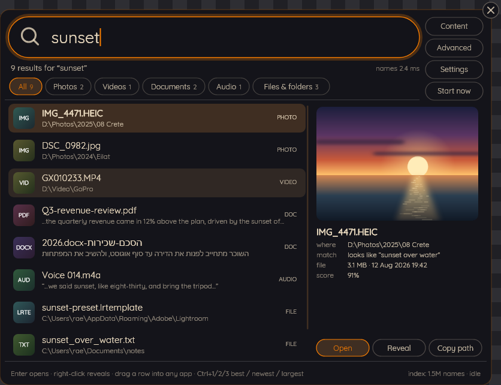
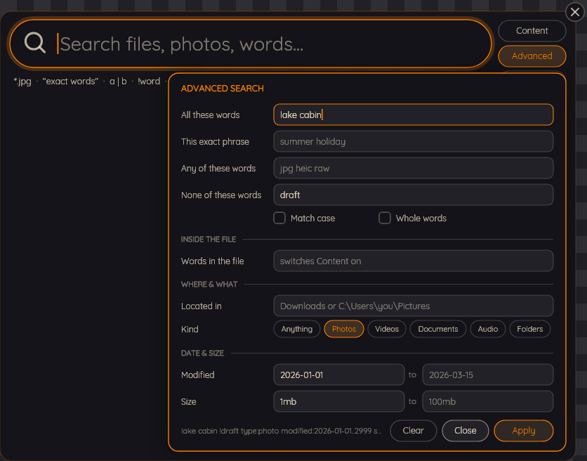
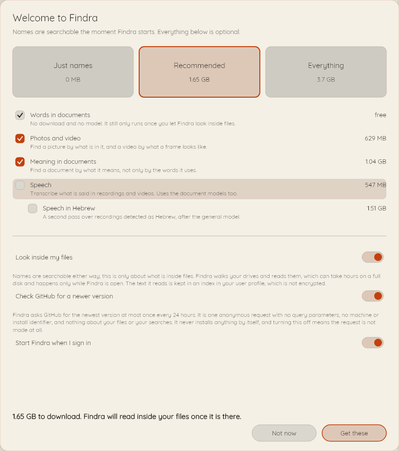
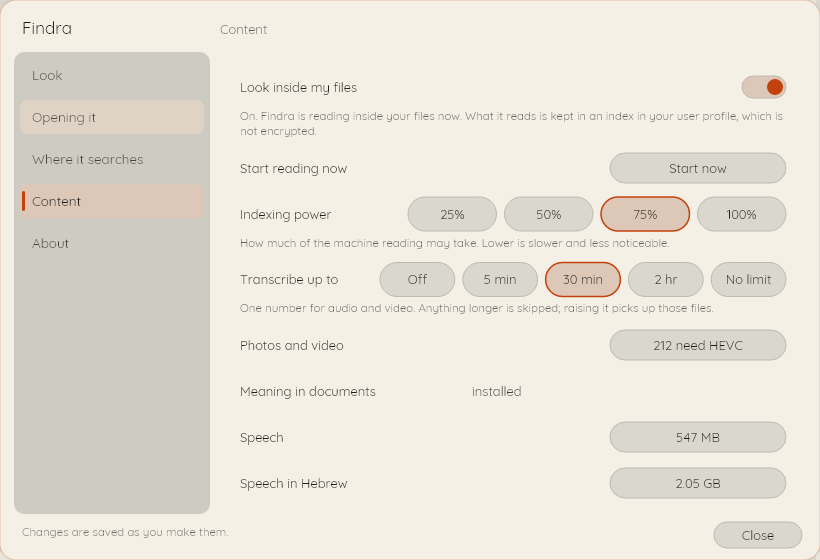
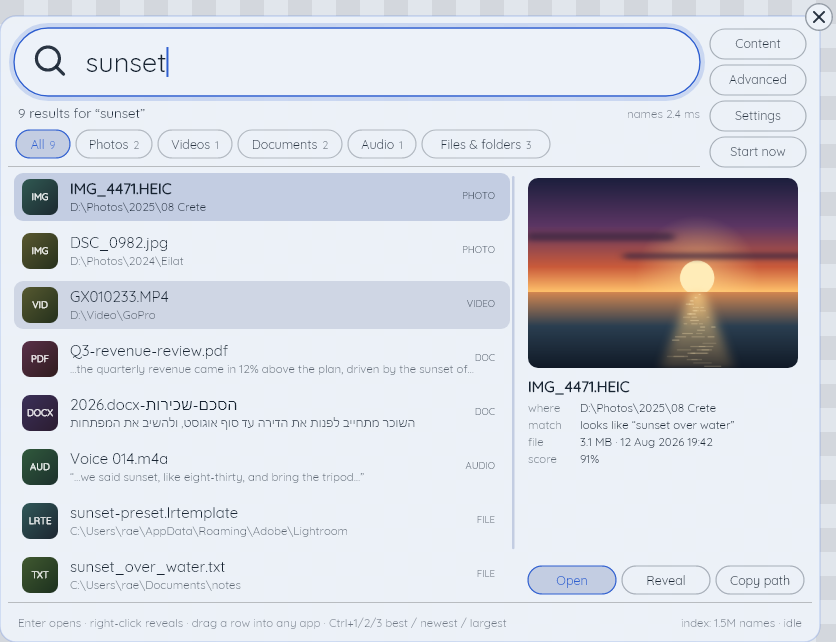

# Findra

Desktop search for Windows. A capsule sits on your desktop; click it, or press a global
hotkey, and it unfolds into a results card. It finds files by name the second it starts, and
it can be taught to find them by what is written inside them, by what a photo shows, and by
what was said in a recording.

Everything happens on your machine. There is no account, no cloud and no telemetry.

Findra has a page of its own at https://findra-search.netlify.app. Its screenshots are the
same renders as the ones here, drawn by the same commands.

`findra --searchshot docs/shots/capsule.png capsule Mond`

## Free, and yours to keep

Findra is licensed under Apache-2.0. You may use it, clone it, change it and ship your
changes. The one condition is attribution, and it travels with the code: keep the `NOTICE`
file, which credits blakazulu and points at https://github.com/blakazulu/findra, and keep it
in anything you build on top. That is the whole deal. Both files are installed beside Findra's
own executable as well as kept here, so an installed copy carries the terms and the attribution
without going back to the repository for them.

The Quicksand typeface ships inside the application under the SIL Open Font License 1.1,
reproduced in `assets/fonts/OFL.txt`. It is not covered by Findra's own licence.

## What it finds

`findra --searchshot docs/shots/results.png results Mond`

| What you can search for | Needs a model | On by default |
|---|---|---|
| Names of files and folders, across every NTFS volume | no | yes, from the moment Findra starts |
| Words in documents, and the text inside pictures | no | no, until you turn content indexing on |
| Photos and video, by what is in the frame | yes | no |
| Documents by what they mean, not only the words they use | yes | no |
| Speech in recordings, including a second pass for Hebrew | yes | no |

Names are free because a name index costs seconds to build and about 73 MB of RAM for a
million and a half files. Reading inside files walks every drive and can run for hours, so it
never starts on its own. `findra --content on` starts it and `findra --content off` stops it
without throwing away anything already read.

Everything Findra can install is 2.93 GB of model files, and that is the number if you take
all of them. Take none and Findra still searches every name on the machine. Take one and you
pay for one. `findra --models` prints what each capability would add given what is already
there, which is the question that matters once some of them are.

Typing has a grammar, and there is a form for the parts of it nobody remembers.

`findra --searchshot docs/shots/advanced.png adv Mond`

## Install

    winget install blakazulu.Findra

That is the whole install, on x64 and arm64 alike. Every release also carries an installer built
by `installer/findra.iss` for each architecture, on its
[releases page](https://github.com/blakazulu/findra/releases/latest).

Building from source works too, and needs the .NET 10 SDK and nothing else.

    git clone https://github.com/blakazulu/findra
    cd findra
    dotnet build
    dotnet test
    dotnet publish src/Findra -c Release --self-contained

Run the interface with `dotnet run --project src/Findra`. Name search needs the helper, which
needs administrator rights exactly once, to open the volume:

    dotnet run --project src/Findra -- --names

Neither the installer nor the executables are signed yet, so Windows will warn about an
unknown publisher until that changes; `docs/code-signing-policy.md` says where that stands and
the site carries the same page at
[/code-signing/](https://findra-search.netlify.app/code-signing/).

Findra never installs anything by itself. It checks whether a newer version exists and tells
you; replacing a running executable and re-registering an elevated task are the two things
most likely to leave a machine broken, and it declines to do either behind your back.

## What it costs, the first time you run it

The first screen asks one question and then gets out of the way. Take a preset, take one
capability, or take nothing at all. Each row is priced at its own download and that number
never moves, so the four of them add up to the 2.93 GB the Everything tile quotes. The line
along the bottom is what your selection actually costs, and it is smaller than the rows added
together whenever two capabilities share a file: Speech is searched like a document, so taking
it takes the document models with it, and you are never charged twice for the same download.

Ticking Speech also puts the transcription limit on that screen, because the screen that signs
you up for transcription is the screen that should ask how much of a recording is worth
transcribing. It is one number for audio and video together - five minutes by default, which
covers a voice memo and cuts a lecture short. A video longer than the limit is still indexed by
its frames if you took Photos, and raising the limit later goes back for exactly the files it
passed over.

`findra --searchshot docs/shots/firstrun.png firstrun Paper`

Nothing on that screen is permanent. Everything on it is in Settings afterwards, and a
capability taken later re-reads only the files it covers rather than starting again. Findra
starts that reading within seconds of the files landing, whether you took the capability from
Settings or from `findra --models install`, and without being restarted. Searching by the new
capability is the half that waits: the card loads its own side of one when Findra starts, so
restart it once before you look for a photo by what is in it.

`findra --searchshot docs/shots/settings.png settingscontent Paper`

Settings is on the card itself, under Advanced, as well as on the tray icon and a right-click
on the capsule. "Start now" begins reading inside files in that session and the sentence above
it says so; "Indexing power" is how much of the machine that reading may take, which the
indexer has always honoured and until now could only be changed by hand.

A global hotkey opens the card from anywhere, over whatever you were doing. If the
combination you asked for is already taken, Findra walks a fallback chain, takes the first
that registers, and tells you which one it landed on rather than failing quietly.

Six palettes ship, three dark and three light. Pick one of each and Findra follows the
Windows setting, or pin it to either. `%APPDATA%\Findra\palettes.json` takes your own.

`findra --searchshot docs/shots/light.png results Blueprint`

## Check it yourself

Findra is built to be verified without a screen. Every number on this page came out of one of
these, and every image above was drawn by the same painter the window uses.

    findra --version                  which build this is, and where its logs are
    findra --searchtest               engine self-check
    findra --searchprobe sunset       the whole query path, end to end: which process
                                      answered, the generation counter, the round trip
    findra --searchindex q:invoice    what is indexed and what is queued; given paths
                                      instead, it queues them and drains the queue
    findra --searchindex why:C:.png   why one file did or did not match, and what the
                                      index holds about it. Reads and changes nothing
    findra --searchmodels             which models are on disk, whether they load, whether
                                      they agree, and which execution provider answered
    findra --searchshot out.png results Mond   render any surface to a PNG
    findra --searchbench out.md 10000 measured numbers, as Markdown fit to paste
    findra --models install recommended        take a capability from the command line
    findra --content on               start reading inside files
    findra --uninstall --dry-run      what removing Findra would do, without doing it

`findra --searchshot` draws twenty-three surfaces in any of the six palettes, which is how the
images on this page are made and how they are regenerated. The command under each image is
the whole recipe.

Findra has no console window of its own, so nothing black appears when you double-click it or
sign in with it starting automatically. The commands above still print into the terminal you
type them at, and still write to a file when you redirect them there. The one visible
consequence is that your shell does not wait for them: the prompt comes back before the text
does. `dotnet run --project src/Findra -- --searchtest` waits, if you would rather it did.

## The numbers

What follows was produced by `findra --searchbench readme-bench.md 10000` and pasted without
editing. Ten thousand rather than the default 2,500, because a run of a second or two
disagrees with itself by more than a published rate deserves.

Two things to read honestly. The content index on this machine held ten documents at the time,
so the full-text table measures the query path rather than a large corpus, and its hit counts
say so. And the extraction row is measured over files the benchmark generates and then deletes,
which is what makes it reproducible on your machine rather than a fact about this one.

## Findra benchmark

Produced by `findra --searchbench`. Every number below was measured on the machine
named here, by this build, and re-running that command reproduces the whole page.

**One machine, and it has an NVIDIA card.** These numbers come from a single desktop with a
discrete NVIDIA GPU, so they say what Findra does there and nothing about anywhere else.
Findra is built to run on AMD and Intel processors, on AMD, Intel and NVIDIA graphics,
on integrated graphics, and on machines with no usable accelerator at all - but of those,
only this configuration and the processor-only path have actually been measured.
**AMD and Intel graphics have not been tested on real hardware.** The vendor-neutral paths
are chosen precisely so that they should work there; that is a design decision, not a
measurement, and it is written here as one.

### Machine

| Part | Value |
|---|---|
| CPU | AMD Ryzen 9 9900X3D 12-Core Processor |
| Architecture | X64 |
| RAM | 47.1 GB |
| Disk | NVMe SSD |
| Windows | Windows 11 Pro 10.0.26200.9168 |
| Accelerator | ONNX: DirectML · Whisper: not loaded |
| Findra | 0.1.0 |

### Volumes

| Volume | Names | Name index resident | Cold-start enumeration | Journal position |
|---|---|---|---|---|
| C: | 1,573,675 | 73.1 MB | 2,769 ms | 29,755,440,672 |

### Name query latency

| Query | Round trip p50 | Round trip p95 | Index scan p50 | Pipe share p50 | Worst | Hits | Samples |
|---|---|---|---|---|---|---|---|
| report | 0.54 ms | 0.61 ms | 0.16 ms | 0.38 ms | 1.31 ms | 50 | n=50 |
| invoice | 2.53 ms | 5.04 ms | 2.13 ms | 0.40 ms | 5.42 ms | 45 | n=50 |
| sunset | 3.99 ms | 4.43 ms | 3.55 ms | 0.44 ms | 5.20 ms | 35 | n=50 |
| readme | 1.00 ms | 1.06 ms | 0.51 ms | 0.49 ms | 1.33 ms | 50 | n=50 |
| config | 0.50 ms | 0.54 ms | 0.06 ms | 0.45 ms | 0.56 ms | 50 | n=50 |

### Full-text query latency

| Query | p50 | p95 | Worst | Hits | Samples |
|---|---|---|---|---|---|
| lease | 0.31 ms | 0.41 ms | 0.79 ms | 3 | n=50 |
| agreement | 0.20 ms | 0.22 ms | 0.26 ms | 4 | n=50 |
| invoice | 0.18 ms | 0.20 ms | 0.23 ms | 3 | n=50 |
| total | 0.35 ms | 0.45 ms | 0.79 ms | 5 | n=50 |
| report | 0.69 ms | 0.91 ms | 0.95 ms | 8 | n=50 |

### Document extraction

| Kind | Files | Seconds | files/min | MB/s |
|---|---|---|---|---|
| Doc | 11,000 | 11.49 | 57,464 | 6.89 |

### Stores

| Store | Path | Size |
|---|---|---|
| search.db | %LOCALAPPDATA%\Findra\index\search.db | 1.8 MB |
| search.db-wal | %LOCALAPPDATA%\Findra\index\search.db-wal | 0 B |
| search.db-shm | %LOCALAPPDATA%\Findra\index\search.db-shm | 32.0 KB |

Indexed items: 10. Text segments: 924.

Corpus for the extraction row: 10,000 generated .txt of 8 KB and 1,000 generated .docx of 1 KB, indexed into a throwaway database with no model loaded, and deleted.

## What leaves your machine

Your files, their names, their contents and your searches never leave your machine. There is
no account, no cloud service, no analytics, no crash reporting and no telemetry.

Findra makes exactly one request on its own, and it is written down here rather than
buried (the other time it uses the network is a model download you asked for): an
anonymous HTTPS GET to the GitHub releases API, at most once every 24 hours, on startup, in
the background, to learn whether a newer version exists. It carries no query parameters, no
machine identifier, no install identifier, and nothing about your files or your searches. It
never blocks anything, and a failure is a line in the log rather than a dialog. It is
disclosed on the first-run screen and can be switched off, and off means the request is not
made at all.

Downloading a capability's model files is a separate thing, and it happens only when you
choose a capability and ask for it.

Full detail, including what the index contains and what the logs record, is in
[PRIVACY.md](PRIVACY.md). If you have found a security problem rather than a bug,
[SECURITY.md](SECURITY.md) says where to send it, which is not the issue tracker.

## Removing it

    findra --uninstall              stop everything, remove the elevated logon task, the
                                    autostart entry and the program files
    findra --uninstall --purge      also delete the models, the index and the settings

Uninstalling always removes the `HighestAvailable` scheduled task, because an elevated logon
task pointing at a binary that is no longer there is a defect and not an inconvenience. It
keeps your models, your index and your settings by default; deleting them is a checkbox in
the installer's uninstaller and `--purge` on the command line, and either way you are told
the measured size it would free before it happens.

`findra --uninstall --dry-run` prints the whole plan and changes nothing.

## Licence

Apache-2.0. Free to use, clone and modify, with attribution to blakazulu and
https://github.com/blakazulu/findra that travels with the code. See `LICENSE` for the terms
and `NOTICE` for the attribution you must keep.
